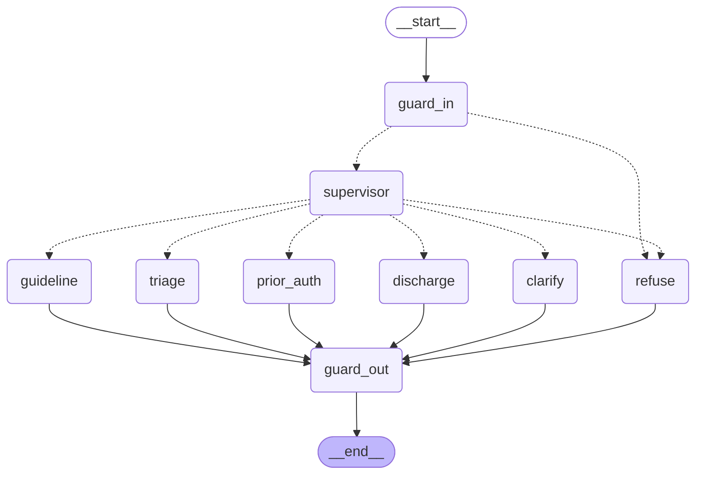

# Clinical Agent Mesh

A hierarchical multi-agent clinical assistant. A structured-output **supervisor**
routes each query to one of four **isolated LangGraph specialist subgraphs**, over
grounded public clinical corpora, behind input and output guardrail nodes.

Rendered from the compiled graph (`mesh.get_graph().draw_mermaid()`), so it cannot
drift from the code:



Note the edge from `guard_in` straight to `refuse`: a blocked query never reaches
the supervisor, so the classifier never sees an injection payload.

## Read this first

- **No real patient data.** Every corpus is public-domain or open-access (MedlinePlus,
  PubMed, openFDA, CMS coverage determinations). MIMIC is deliberately **not** used —
  it requires credentialed access.
- **This is not a medical device** and produces no clinical advice. It is an engineering
  portfolio project demonstrating retrieval grounding, agent routing, and evaluation.
- **Depth is uneven by design.** The guideline copilot is built to production depth. The
  other three specialists are demo-depth. The table below states which is which rather
  than implying uniform rigour.
- **No measured metrics yet.** The eval harness is built, tested and CI-gated, but has
  never been run — see [Status](#status). Every number in `docs/RESUME-BULLETS.md` is
  still a bracket, on purpose.

## Status

| Component | Depth | State |
|---|---|---|
| Shared spine (models, state contract) | production | done |
| Retrieval (hybrid BM25 + vector, RRF) | production | done |
| Cross-encoder rerank | production | done (CPU-pinned) |
| Ingestion — 4 corpora, one collection per agent | production | done |
| Guardrails (PHI, injection, citations) | production | done |
| Mesh graph wiring + specialist adapter | production | done |
| Supervisor node + routing benchmark | production | done (33 cases; target 100) |
| Guideline copilot | production | done |
| Triage specialist | demo | done |
| Prior-auth specialist | demo | done (see corpus caveat below) |
| Discharge specialist | demo | done |
| Composition root + `make ask` | production | done |
| Eval harness + red team + CI gate | production | built, **never run** |
| FastAPI + SSE, Postgres checkpointer | production | done |
| Docker image, compose, GitHub Actions | production | done |
| Langfuse tracing | production | not started |

**273 fast tests** (no key, no network, no Chroma), **18 integration** (real Chroma),
**8 network** (live public APIs). `ruff`, `ruff format` and `mypy --strict` clean.

## Quick start

```bash
uv sync --extra postgres --extra observability   # install
cp .env.example .env                             # add your OPENAI_API_KEY
make up                                          # chroma + postgres + api
make ingest                                      # build the four corpora
make ask q="what is first-line therapy for hypertension?"
make eval                                        # print the metrics table
```

Everything except the last three works with no key:

```bash
make check              # lint, types, 273 tests
make test-integration   # 18 more against real Chroma (needs: make up)
make test-network       # 8 against the live public APIs
```

## The four specialists

| Route | Corpus | What makes it more than a prompt |
|---|---|---|
| `guideline` | MedlinePlus + PubMed | plan → retrieve → rerank → draft → verify → revise (max 2) → contradiction check. Refuses rather than return an answer citing an invented chunk |
| `triage` | MedlinePlus symptom pages | Red-flag rules are a **floor** the model may raise but never lower. Emergency banner is a fixed string, never model output |
| `prior_auth` | CMS coverage index | The model marks criteria; `decide_coverage` computes approve/deny/more-info and the prose is composed in code, so it cannot contradict the verdict |
| `discharge` | openFDA drug labels | Interaction lookup is a tool, not recall; reading grade is Flesch-Kincaid arithmetic; warnings are appended verbatim in code |

**Prior-auth corpus caveat.** CMS publishes the coverage policy *index* without a key,
but the criteria text sits behind an AMA/CPT licence token. So `prior_auth` can tell you
which policy governs a request and usually cannot tell you whether the request meets it —
it answers `more_info`. That is the system reporting its evidence honestly. Details in
`docs/DECISIONS.md` §18.

## Design decisions worth defending

| Decision | Why |
|---|---|
| Specialist **subgraphs**, not handler nodes | Each agent owns private state and is testable in isolation; adding a fifth touches no existing one |
| **Hybrid** BM25 + vector with RRF | Drug names and clinical codes are exactly where dense embeddings underperform |
| Guardrails as **graph nodes** | Safety is a step with its own tests, not a paragraph appended to a prompt |
| **Confidence-gated routing** | Below threshold the supervisor asks a clarifying question instead of guessing |
| Refuse when retrieval is **unavailable** | If Chroma is down the system says so rather than answering ungrounded |
| The model never decides **what code can decide** | Urgency floors, coverage verdicts and reading grades are computed, not judged |
| A safety escalation is **exempt from citation checks** | Otherwise a retrieval outage turns "call an ambulance" into "I don't have the evidence" |
| **One collection per agent** | A coverage query shouldn't compete with drug labels for the top-20 slots |
| Regression-**gated** evals in CI | A faithfulness or routing-accuracy drop fails the build |

## Development

```bash
make check              # lint + strict types + 273 fast tests
make test-integration   # real Chroma
make test-network       # live PubMed, MedlinePlus, openFDA, CMS
make test-rerank        # the real cross-encoder (needs --extra rerank)
make eval               # golden set through the whole mesh; fails below threshold
make eval-routing       # routing accuracy + confusion matrix
```

`network`, `rerank` and `integration` are excluded from the default run: the first two
cost money or 30s of torch import, and the third takes the suite from 16s to 4 minutes,
which is long enough that people stop running it.

torch is pinned to the **CPU wheel** via `[tool.uv.sources]`. Default resolution installed
`torch+cu130` and 2.7GB of CUDA libraries — a 5.0GB virtualenv to run a small cross-encoder
that is CPU-only by design. The pin takes it to 1.4GB.

## Documentation

| Document | What it covers |
|---|---|
| `docs/HANDOVER.md` | **Start here.** What was built, in what order, the honest limits, and how to fill in the numbers |
| `docs/DECISIONS.md` | Every design decision, the alternatives rejected, and the bugs found while building |
| `docs/INTERVIEW-GUIDE.md` | How to discuss the project and its real limits |
| `docs/INTERVIEW-QA.md` | 37 likely questions with answers grounded in this codebase |
| `docs/RESUME-BULLETS.md` | Bullet inventory, tagged built / needs-measurement |
| `docs/superpowers/specs/` | The original approved design spec |

## Licence

Code MIT. Corpora retain their original public-domain / open-access terms.
